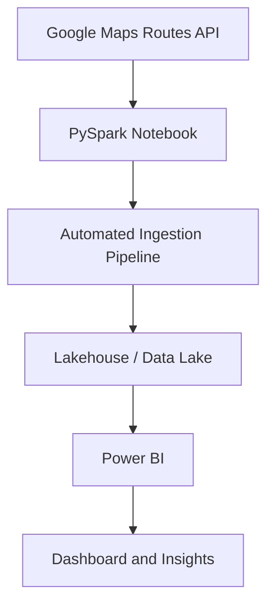
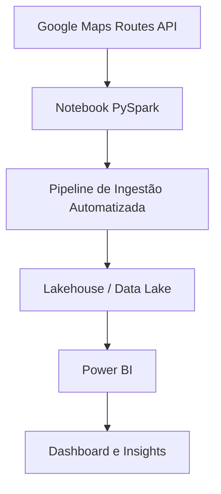

### English Version & Versão em Português (ver mais abaixo)


# 🚗 Data Engineering Applied to Traffic

**How long does it take me to get to college?**  
What if I take another route? What’s the best time to leave?

Simple questions — but for those who face traffic jams every day, intuition isn’t enough: you need data.  
This project demonstrates how **data engineering** can transform daily traffic chaos into **real insights**, applying APIs, pipelines, and data visualization.

## 🧭 Overview

This solution collects travel time estimates (**ETA**) for different routes using the **Google Maps Routes API**, compares **dynamic time (with traffic)** and **static time (without traffic)**, and stores everything in a **Lakehouse** for analysis in **Power BI**.

The goal was to **quantify the traffic I face every day** on my way between home, college, and work — understanding variations, peaks, and route stability.

## 🧩 Solution Architecture



## 🔧 Steps
1. Data Collection
    - Uses the Google Maps Routes API to capture:
      - Dynamic ETA (considering real-time traffic);
      - Static ETA (ignoring traffic conditions).
    - Data was collected every 10 minutes for 7 consecutive days via a Python notebook (`ingest-routes-api-data.ipynb`), scheduled through a Fabric pipeline.
2. Automated Ingestion
    - The notebook exports the data to a Delta Table and loads it into the Lakehouse.
3. Transformation
    - Data cleaning and calculations were done in Power Query:
        - Absolute difference between dynamic and static ETAs;
        - Percentage difference (real traffic impact).
3. Analysis and Visualization
    - In Power BI, data was transformed into visual indicators:
        - Executive KPIs;
        - Route comparisons;
        - Trend narratives throughout the day.

📚 Technologies Used
| Layer          | Tools / Technologies                    |
| :------------- | :-------------------------------------- |
| Collection     | Google Maps Routes API, Python, PySpark |
| Orchestration  | Fabric Pipeline (Scheduling)            |
| Storage        | Lakehouse (Delta Table)                 |
| Transformation | Power Query (Power BI)                  |
| Visualization  | Power BI Desktop and Service            |

# ⚙️ Executions (Step-by-Step)
1. Get a Google Maps Routes API Key
    - Go to Google Cloud Console
    - Enable the Routes API and generate an API Key.

2. Set Variables in the Notebook
    - Replace YOUR_API_KEY with your actual key.
    - Adjust the origin/destination polylines using the script `utils/save_polylines.py`.
  
3. Run the Notebook

```bash
python ingest-routes-api-data.ipynb
```
4. Publish to the Lakehouse
    - Upload the generated files to your configured storage (e.g., Databricks, Azure, GCP, or AWS).

5. Connect Power BI
    - In Power BI Desktop → Get Data → Lakehouse / Parquet / CSV File
    - Perform transformations in Power Query and build dashboards.

# 🚗 Engenharia de Dados Aplicada ao Trânsito

**Quanto tempo eu demoro pra chegar na faculdade?**  
E se eu pegar outro caminho? Qual o melhor horário pra sair?

Perguntas simples - mas que, para quem enfrenta engarrafamentos todos os dias, exigem mais que intuição: exigem dados.  
Este projeto mostra como a **engenharia de dados** pode transformar o trânsito do dia a dia em **insights reais**, aplicando APIs, pipelines e visualização de dados.

## 🧭 Visão Geral

A solução coleta estimativas de tempo de viagem (**ETA**) de diferentes rotas usando a **Google Maps Routes API**, compara o **tempo dinâmico (com tráfego)** e o **tempo estático (sem tráfego)**, e armazena tudo em um **Lakehouse** para análise no **Power BI**.

O objetivo foi **metrificar o trânsito que eu enfrento diariamente** no trajeto entre casa, faculdade e trabalho - entendendo variações, picos e estabilidade das rotas.

## 🧩 Arquitetura da Solução



## 🔧 Etapas
1. Coleta de Dados
    - Utiliza a Google Maps Routes API para capturar:
        - ETA dinâmico (considerando o tráfego atual);
        - ETA estático (sem considerar o tráfego).
    - As coletas ocorreram a cada 10 minutos, por 7 dias consecutivos, via notebook Python (`ingest-routes-api-data.ipynb`) agendado por um pipeline do Fabric.
2. Ingestão Automatizada
    - O notebook exporta os dados para uma tabela delta e insere no Lakehouse.
3. Transformação
    - A limpeza e os cálculos são feitos no Power Query:
        - Diferença absoluta entre ETA dinâmico e estático;
        - Diferença percentual (impacto real do trânsito).
4. Análise e Visualização
    - No Power BI, os dados são transformados em indicadores visuais:
        - KPIs executivos;
        - Comparações entre rotas;
        - Narrativas de tendência ao longo dos horários do dia.

# 📚 Tecnologias Utilizadas
| Camada        | Ferramentas / Tecnologias               |
| :------------ | :-------------------------------------- |
| Coleta        | Google Maps Routes API, Python, PySpark |s
| Orquestração  | Fabric Pipeline (agendamento)           |
| Armazenamento | Lakehouse (Delta Table)                 |
| Transformação | Power Query (Power BI)                  |
| Visualização  | Power BI Desktop e Service              |

# ⚙️ Execução (passo a passo)
1. Obter chave da Google Maps Routes API
    - Acesse Google Cloud Console
    - Habilite a Routes API e gere uma API Key.
2. Configurar variáveis no notebook
    - Substitua YOUR_API_KEY pela chave obtida.
    - Ajuste as polyines de origem/destino por meio do script `utils/save_polylines.py`
3. Executar o notebook

```bash
python ingest-routes-api-data.ipynb
```

4. Publica no Lakehouse
    - Envie os arquivos para o armazenamento configurado (ex: Databricks, Azure, GCP, AWS).

5. Conectar o Power BI
    - No Power BI Desktop → Obter Dados → Lakehouse / Arquivo Parquet / CSV
    - Realize as transformações no Power Query e monte os dashboards.